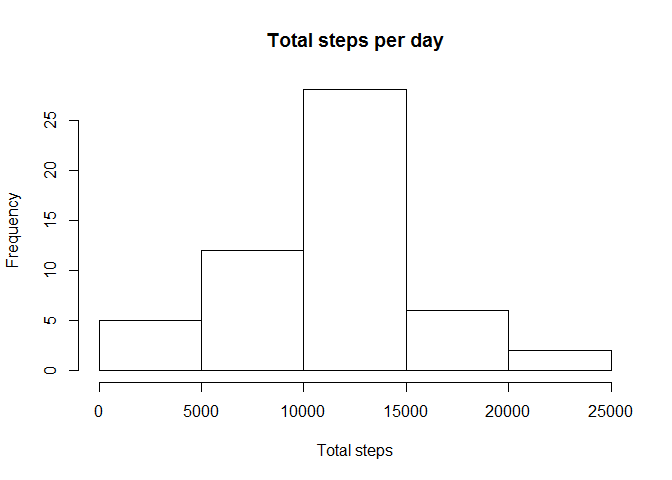
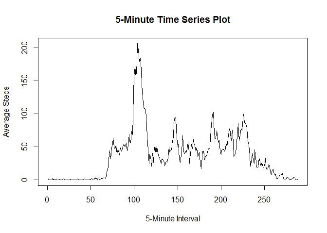
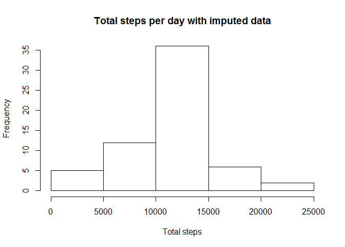
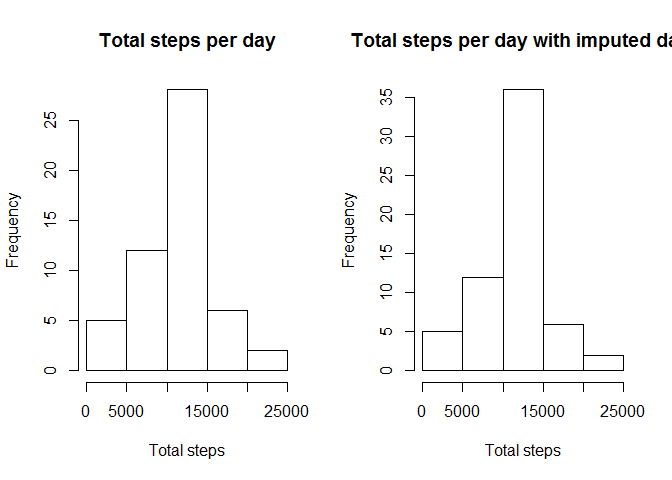

# Reproducible Research: Peer Assessment 1


## Loading and preprocessing the data

```r
##Set Working dir
setwd ("\\\\UPLCI084736/USERS$/gjf510/MyCloudDrive/Documents/Coursera/RepData_PeerAssessment1")
##Set local language to English (to use English Names)
Sys.setlocale("LC_TIME", "English")  
```

```
## [1] "English_United States.1252"
```

```r
act <- read.csv("activity.csv", header=TRUE, sep=",", skip = 0)
##Process the data
##Convert date to a Date class
act$date <- as.Date(act$date)
```


## What is mean total number of steps taken per day?

```r
##Filter data where complete cases = TRUE
compl_act <- subset(act,complete.cases(act)==TRUE)
##Group by day
compl_act_day <- split(compl_act, compl_act$date)
#What is the total number of steps taken per day?
totsteps <- sapply(compl_act_day,function(x) sum(x$steps))
##Create a Histogram of the total number of steps during each day
hist(totsteps, main="Total steps per day",xlab="Total steps", ylab="Frequency")
```

 

```r
#What is mean total number of steps taken per day?
round(mean(totsteps))
```

```
## [1] 10766
```

```r
median(totsteps)
```

```
## [1] 10765
```


## What is the average daily activity pattern?
Make a time series plot (i.e. type = "l") of the 5-minute interval (x-axis) and the average number of steps taken, averaged across all days (y-axis)

```r
##Filter data where complete cases = TRUE
compl_act <- subset(act,complete.cases(act)==TRUE)
##Split by interval
compl_act_int <- split(compl_act, compl_act$interval)
##Create Average
int_average <- sapply(compl_act_int,function(x) mean(x$steps))
##Create the plot
plot(int_average,type="l",ylab="Average Steps",xlab="5-Minute Interval",main="5-Minute Time Series Plot")
```

 

Which 5-minute interval, on average across all the days in the dataset, contains the maximum number of steps?

```r
##Print the interval with the max steps
names(which.max(int_average))
```

```
## [1] "835"
```

## Imputing missing values
Calculate and report the total number of missing values in the dataset (i.e. the total number of rows with NAs)

```r
##Count incomplete cases
incompl <- !complete.cases(act)
sum(incompl)
```

```
## [1] 2304
```


Use the Hmisc packages to generate missing values , based on the mean of a specific column (in this case, steps)
install.packages("Hmisc")


```r
library(Hmisc)
```

```
## Loading required package: grid
## Loading required package: lattice
## Loading required package: survival
## Loading required package: splines
## Loading required package: Formula
## 
## Attaching package: 'Hmisc'
## 
## The following objects are masked from 'package:base':
## 
##     format.pval, round.POSIXt, trunc.POSIXt, units
```

```r
act$steps <- with(act, impute(steps, mean))
comp_act <- split(act, act$date)
comp_act <- sapply(comp_act,function(x) sum(x$steps))
hist(comp_act, main="Total steps per day with imputed data",xlab="Total steps", ylab="Frequency")
```

 

```r
#What is mean total number of steps taken per day?
round(mean(comp_act))
```

```
## [1] 10766
```

```r
round(median(comp_act))
```

```
## [1] 10766
```


```r
par(mfrow=c(1,2))
hist(totsteps, main="Total steps per day",xlab="Total steps", ylab="Frequency")
hist(comp_act, main="Total steps per day with imputed data",xlab="Total steps", ylab="Frequency")
```

 

The result is that the mean and median are the same now.
Also the frequency is changed in the Histogram

## Are there differences in activity patterns between weekdays and weekends?

```r
act$day <- weekdays(act$date)
for (i in 1:nrow(act)) {
        if(act[i,]$day %in% c("Saturday","Sunday")) {
                act[i,]$day <-"Weekend"
        }
        else{
                act[i,]$day <- "Weekday"
        }
}
```
##Create the plot
act_int <- split(act, act$interval)
act_average <- sapply(act_int,function(x) mean(x$steps))
act_average <- as.data.frame(act_average)
par(mfrow=c(1,1))  

##nok OK (missing days)
with(act_average, plot(steps ~ interval, type="n", main="Weekday vs Weekend"))  
with(act_average[act_average$day == "Weekday",], lines(steps ~ interval, type="l", col="2"))  
with(act_average[act_average$day == "Weekend",], lines(steps ~ interval, type="l", col="3" ))  
legend("topright", lty=c(1,1), col = c("2", "3"), legend = c("weekday", "weekend"), seg.len=3)


